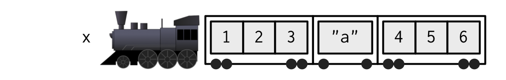
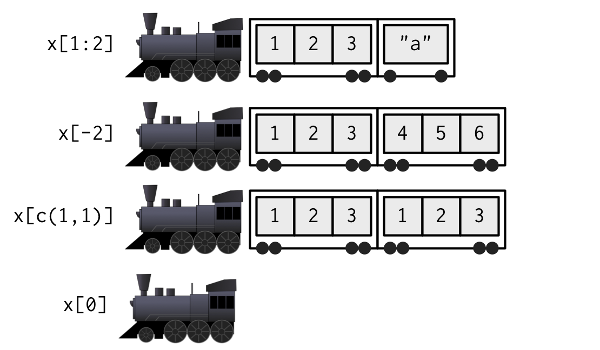

```{r setup}
#| include: False
options(
  width=80
)
```

## Subsetting in General

R has three subsetting operators (`[`, `[[`, and `$`). The behavior of these operators depends on the object (class) they are being used with.

<br/>

In general there are 6 different types of subsetting that can be performed:

:::: {.columns}
::: {.column width='50%'}
* Positive integer

* Negative integer

* Logical value
:::
::: {.column width='50%'}
* Empty / NULL

* Zero valued

* Character value (names)
:::
::::

## Positive Integer subsetting

Returns elements at the given location(s)


:::: {.columns .small}
::: {.column width='50%'}
```{r}
x = c(1,4,7)
```
```{r}
x[1]
x[c(1,3)]
x[c(1,1)]
x[c(1.9,2.1)]
```
:::

::: {.column width='50%'}
```{r}
y = list(1,4,7)
```

```{r}
str( y[1] )
str( y[c(1,3)] )
str( y[c(1,1)] )
str( y[c(1.9,2.1)] )
```
:::
::::

::: {.aside}
Note - R uses a 1-based indexing scheme
:::

## Negative Integer subsetting

Excludes elements at the given location(s)

:::: {.columns .small}
::: {.column width='50%'}
```{r, error=TRUE}
x = c(1,4,7)
```

```{r, error=TRUE}
x[-1]
x[-c(1,3)]
x[c(-1,-1)]
```
:::
::: {.column width='50%'}
```{r, error=TRUE}
y = list(1,4,7)
```

```{r, error=TRUE}
str( y[-1] )
str( y[-c(1,3)] )
```
:::
::::

. . .

::: {.small}
```{r}
#| error: True
x[c(-1,2)]
y[c(-1,2)]
```
:::

## Logical Value Subsetting

Returns elements that correspond to `TRUE` in the logical vector. Length of the logical vector is coerced to be the same as the vector being subsetted.


:::: {.columns .small}
::: {.column width='50%'}
```{r}
x = c(1,4,7,12)
```
```{r, error=TRUE}
x[c(TRUE,TRUE,FALSE,TRUE)]
x[c(TRUE,FALSE)]
```
:::
::: {.column width='50%'}
```{r, error=TRUE}
y = list(1,4,7,12)
```
```{r, error=TRUE}
str( y[c(TRUE,TRUE,FALSE,TRUE)] )
str( y[c(TRUE,FALSE)] )
```
:::
::::

. . .

:::: {.columns .small}
::: {.column width='50%'}
```{r}
#| error: True
x[x %% 2 == 0]
```
:::
::: {.column width='50%'}
```{r}
#| error: True
str( y[y %% 2 == 0] )
```
:::
::::


## Empty Subsetting

Returns the original vector, this is not the same as subsetting with `NULL`

:::: {.columns .small}
::: {.column width='50%'}
```{r}
x = c(1,4,7)
```
```{r}
x[]
x[NULL]
```
:::
::: {.column width='50%'}
```{r}
y = list(1,4,7)
```
```{r}
str(y[])
str(y[NULL])
```
:::
::::


## Zero subsetting

Returns an empty vector (of the same type), this is the same as subsetting with `NULL`

:::: {.columns .small}
::: {.column width='50%'}
```{r}
x = c(1,4,7)
```

```{r}
x[0]
```
:::
::: {.column width='50%'}
```{r}
y = list(1,4,7)
str(y[0])
```
:::
::::

. . .

`0`s can be mixed with either positive or negative integers for subsetting, but they are ignored in both cases.


:::: {.columns .small}
::: {.column width='50%'}
```{r}
x[c(0,1)]
y[c(0,1)]
```
:::
::: {.column width='50%'}
```{r}
x[c(0,-1)]
y[c(0,-1)]
```
:::
::::


## Character subsetting

If the vector has names, selects elements whose names correspond to the values in the name vector.

:::: {.columns .small}
::: {.column width='50%'}
```{r}
x = c(a=1, b=4, c=7)
```

```{r}
x["a"]
x[c("a","a")]
x[c("b","c")]
```
:::
::: {.column width='50%'}
```{r}
y = list(a=1,b=4,c=7)
```

```{r}
str(y["a"])
str(y[c("a","a")])
str(y[c("b","c")])
```
:::
::::

## Out of bounds

:::: {.columns .small}
::: {.column width='50%'}
```{r}
x = c(1,4,7)
```

```{r}
x[4]
x[-4]
x["a"]
x[c(1,4)]
```
:::
::: {.column width='50%'}
```{r}
y = list(1,4,7)
```
```{r}
str(y[4])
str(y[-4])
str(y["a"])
str(y[c(1,4)])
```
:::
::::

## Missing values

:::: {.columns .small}
::: {.column width='50%'}
```{r}
x = c(1,4,7)
```
```{r}
x[NA]
x[c(1,NA)]
```
:::
::: {.column width='50%'}
```{r}
y = list(1,4,7)
```
```{r}
str(y[NA])
str(y[c(1,NA)])
```
:::
::::

## NULL and empty vectors (length 0)

This final type of subsetting follows the rules for length coercion with a 0-length vector (i.e. the vector being subset gets coerced to having length 0 if the subsetting vector has length 0)

:::: {.columns .small}
::: {.column width='50%'}
```{r}
x = c(1,4,7)
```
```{r}
x[NULL]
x[integer()]
x[character()]
```
:::
::: {.column width='50%'}
```{r}
y = list(1,4,7)
```
```{r}
y[NULL]
y[integer()]
y[character()]
```
:::
::::


## Exercise 1

::: {.medium}
Below are 100 values, write down how you would create a subset to <br/>accomplish each of the following:

* Select every third value starting at position 2 in `x`.

* Remove all values with an odd index (e.g. 1, 3, etc.)

* Remove every 4th value, but only if it is odd.
:::

```{r}
#| min-lines: 8
x = c(56, 3, 17, 2, 4, 9, 6, 5, 19, 5, 2, 3, 5, 0, 13, 12, 6, 31, 10, 21, 8, 4, 1, 1, 2, 5, 16, 1, 3, 8, 1,
      3, 4, 8, 5, 2, 8, 6, 18, 40, 10, 20, 1, 27, 2, 11, 14, 5, 7, 0, 3, 0, 7, 0, 8, 10, 10, 12, 8, 82,
      21, 3, 34, 55, 18, 2, 9, 29, 1, 4, 7, 14, 7, 1, 2, 7, 4, 74, 5, 0, 3, 13, 2, 8, 1, 6, 13, 7, 1, 10,
      5, 2, 4, 4, 14, 15, 4, 17, 1, 9)


```


## Subsetting and assignment

Subsets can also be used with assignment to update specific values within an object (in-place).

::: {.small}
```{r}
x = c(1, 4, 7, 9, 10, 15)
```
:::

. . .

::: {.small}
```{r}
x[2] = 2
x
```
:::

. . .

::: {.small}
```{r}
x %% 2 != 0
```
:::

. . .

::: {.small}
```{r}
x[x %% 2 != 0] = (x[x %% 2 != 0] + 1) / 2
x
```
:::

##

::: {.columns .small}
::: {.column}
```{r}
x[c(1,1)] = c(2,3)
x
```

```{r}
x = 1:6
```

```{r}
x[c(2,NA)] = 1
x
```

::: {.fragment}
```{r}
x = 1:6
```
```{r}
x[c(-1,-2)] = 3
x
```
:::
:::
::: {.column .fragment}
```{r}
x = 1:6
```
```{r}
x[c(TRUE,NA)] = 1
x
```


::: {.fragment}
```{r}
x = 1:6
```
```{r}
x[] = 1:3
x
```
:::
:::
:::


# The other subset operators <br/> `[[` and `$`


## Atomic vectors - [ vs. [[

`[[` subsets like `[` except it can only subset for a *single* value

::: {.small}
```{r, error=TRUE}
x = c(a=1,b=4,c=7)
```

```{r}
x[1]
```
:::

. . .

::: {.small}
```{r, error=TRUE}
x[[1]]
```
:::

. . .

::: {.small}
```{r, error=TRUE}
x[["a"]]
```
:::

. . .

::: {.small}
```{r, error=TRUE}
x[[1:2]]
```
:::

. . .

::: {.small}
```{r, error=TRUE}
x[[TRUE]]
```
:::

## Generic Vectors (lists) - [ vs. [[

Subsets a single value, but returns the value - not a list containing that value. Multiple values are interpreted as nested subsetting.

::: {.small}
```{r, error=TRUE}
y = list(a=1, b=4, c=7:9)
```
:::

:::: {.columns .small}
::: {.column width='50%'}
```{r, error=TRUE}
y[2]
```
:::
::: {.column width='50%'}
```{r, error=TRUE}
str( y[2] )
```
:::
::::

. . .

::: {.small}
```{r, error=TRUE}
y[[2]]
y[["b"]]
y[[1:2]]
y[[2:1]]
```
:::

## Hadley's Analogy (1)

```{r echo=FALSE, fig.align="center", out.width="37%"}

```
. . .
```{r echo=FALSE, fig.align="center", out.width="37%"}
knitr::include_graphics("imgs/list_train2.png")
```
. . .
```{r echo=FALSE, fig.align="center", out.width="37%"}

```


::: {.aside}
From Advanced R - [Chapter 4.3](https://adv-r.hadley.nz/subsetting.html#subset-single)
:::

## Hadley's Analogy (2)

```{r echo=FALSE, fig.align="center", out.width="80%"}
knitr::include_graphics("imgs/pepper_subset.png")
```

## [[ vs. $

`$` is equivalent to `[[` but it only works for name based subsetting of *lists* (it also uses partial matching for names)

::: {.medium}
```{r, error=TRUE}
x = c("abc"=1, "def"=5)
```

```{r, error=TRUE}
x$abc
```
:::

. . .

::: {.medium}
```{r}
y = list("abc"=1, "def"=5)
```

```{r}
y[["abc"]]
y$abc
y$d
```
:::

## A common error

Why does the following code not work?

```{r}
#| error: True
x = list(abc = 1:10, def = 10:1)
y = "abc"
```

:::: {.columns}
::: {.column width='50%'}
```{r}
x[[y]]
```
:::
::: {.column width='50%'}
```{r}
x$y
```
:::
::::

. . .

The expression `x$y` gets interpreted as `x[["y"]]` by R, note the inclusion of the `"`s, this is not the same as the expression `x[[y]]`.

