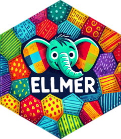

```{r setup}
#| message: False
#| warning: False
#| include: False
knitr::opts_chunk$set(
  fig.align = "center", fig.retina = 2, dpi = 150
)

library(testthat)

options(width=50)
options(tibble.width = 50)
```

# A recap of some of<br/>Hadley's points

<br/> <br/>

::: {.center .small}
Watch his talk linked on the course website if you haven't already!
:::

## DukeGPT API - Setup

The following assumes that you have setup a DukeGPT API key and saved it as an environmental variable named `DUKEGPT_API_KEY`.

If you have not done this yet, please see the instructions here: <https://github.com/DukeStatSci/dukegpt_codex_guide>.


## DukeGPT API - Models & "Cost"

Each model has different capabilities and different costs. Here are the current models available via the DukeGPT API:

Every user can have at most 1 API key and each API key is allocated $1 / day of free usage. Additional usage requires a fund code.


::: {.xsmall}
| Model                  | Company | Cloud vs. On-Prem | Input Cost (per 1M tokens) | Output Cost (per 1M tokens) |
|-------------------------|---------|-------------------|----------------------------|-----------------------------|
| Llama 3.3              | Meta    | cloud             | $0.71                      | $0.71                       |
| Llama 4 Maverick       | Meta    | cloud             | $0.35                      | $1.41                       |
| Llama 4 Scout          | Meta    | cloud             | $0.20                      | $0.78                       |
| gpt-5                  | OpenAI  | cloud             | $1.25                      | $10.00                      |
| gpt-5-chat             | OpenAI  | cloud             | $1.25                      | $10.00                      |
| gpt-5-mini             | OpenAI  | cloud             | $0.25                      | $2.00                       |
| gpt-5-nano             | OpenAI  | cloud             | $0.05                      | $0.40                       |
| GPT 4.1                | OpenAI  | cloud             | $2.00                      | $8.00                       |
| GPT 4.1 Mini           | OpenAI  | cloud             | $0.40                      | $1.60                       |
| GPT 4.1 Nano           | OpenAI  | cloud             | $0.10                      | $0.40                       |
| o4 Mini                | OpenAI  | cloud             | $1.10                      | $4.40                       |
| text-embedding-3-small | OpenAI  | cloud             | $0.02                      | -                           |
| Mistral on-site        | Mistral | on-premise        | no cost                    | no cost                     |

:::


## 

{fig-align="center" width="150px"}


> ellmer makes it easy to use large language models (LLM) from R. It supports a wide variety of LLM providers and implements a rich set of features including streaming outputs, tool/function calling, structured data extraction, and more.


## Some basic ellmer

::: {.small}
```{r}
library(ellmer)
chat = chat_openai(
  base_url="https://litellm.oit.duke.edu/", 
  api_key=Sys.getenv("DUKEGPT_API_KEY"), 
  model = "GPT 4.1"
)
```

:::

. . .

::: {.small}
```{r chat_hello}
#| cache: true
chat$chat("Hello, who are you?")
```

:::


::: {.aside}
The DukeGPT API is running using a platform called litellm which provides an API based on OpenAI's API spec, hence why we use `chat_openai()`.
:::

## LLMs are stochastic and have limitations

::: {.xxsmall}

::: {.columns}
::: {.column}
```{r count1}
#| cache: true
chat$chat(
  "How many n's in unconventional?"
)
```

::: {.fragment}
```{r count2}
#| cache: true
chat$chat(
  "How many n's in unconventional?"
)
```
:::

::: {.fragment}
```{r count3}
#| cache: true
chat$chat(
  "How many n's in unconventional?"
)
```
:::
:::
::: {.column .fragment}
```{r count4}
#| cache: true
chat$chat(
  "How many n's in unconventional?"
)
```
::: {.fragment}
```{r count5}
#| cache: true
chat$chat(
  "How many n's in unconventional?"
  )
```
:::

::: {.fragment}
```{r count6}
#| cache: true
chat$chat(
  "How many n's in unconventional?"
)
```
:::

:::
:::

:::

## Answer shaped objects


::: {.xsmall}
```{r}
x = 123456789
y = 12345678
```
:::

::: {.columns .xsmall}
::: {.column}
```{r mult1}
#| cache: true
chat$chat( interpolate(
  "What is {{x}} * {{y}} in plain text?"
) )
```

::: {.fragment}
```{r mult2}
#| cache: true
chat$chat( interpolate(
  "What is {{x}} * {{y}} in plain text?"
) )
```
:::

::: {.fragment}
```{r mult3}
#| cache: true
chat$chat( interpolate(
  "What is {{x}} * {{y}} in plain text?"
) )
```
:::

:::
::: {.column .fragment}
```{r}
formatC(x * y, digits = 16)
```
:::
:::

::: {.aside}
Partly why we're using GPT 4.1 is because it still makes this mistake - GPT-5 reports the correct answer (but it takes a suspiciously long time to get the right answer).
:::

## Hadley's initial "conclusions"

<p/>

::: {.large}
> So LLMs kind of suck:
>
> * The results are stochastic
> * The models are constantly changing
> * The difference between good results and bad results can be razor thin (⚡jagged edge⚡)
> * They almost always give plausible results 
> * They rarely admit doubt or lack of knowledge
:::

. . .

LLM corollary of Box's famous aphorism:

> All models are wrong, but some are useful.

## Image processing

::: {.small}
```{r image_desc}
#| cache: true
chat$chat(
  "Describe the hex logo image I've attached to this request.",
  content_image_file("imgs/hex-ellmer.png")
)
```
:::

## {.scrollable}

::: {.xsmall}
```{r dino_plot}
#| cache: true
#| out-width: "35%"
#| fig-height: 5
#| fig-width: 5

d = datasauRus::datasaurus_dozen
plot(d[d$dataset == "dino", -1])

chat$chat(
  "Describe the any patterns in the plot I've attached to this request. Be Concise.",
  content_image_plot()
)
```
:::


## Structured data extraction

::: {.small}
```{r dunson_awards}
#| cache: true
chat5 = chat_openai(
  base_url="https://litellm.oit.duke.edu/", 
  api_key=Sys.getenv("DUKEGPT_API_KEY"), 
  model = "gpt-5-mini"
)

url = "https://www.daviddunson.com/_files/ugd/8f5f43_20c21592aeea4324be817b581526fbfc.pdf"

type_award = type_object(
  "Summary of award",
  name = type_string("Name of the award"),
  grantor = type_string("Granting organization"),
  year = type_integer("Year of the award (4 digit)")
)

df = chat5$chat_structured(
  "Extract a list of the awards received by David Dunson from his attached CV",
  content_pdf_url(url),
  type = type_array(type_award)
)
```
:::

## {.scrollable}


::: {.xsmall}
```{r}
knitr::kable(df)
```
:::


## System prompts

::: {.xsmall}
```{r}
#| eval: false
quiz = chat_openai(
  paste(
    "You are a statistics professor helping students prepare for a quiz.",
    "The quiz will cover basic concepts on writing R packages and testing with the testthat package.",
    "Questions should be presented one at a time and you should keep track of the student's score.",
    "Questions should focus on high level concepts rather than specific syntax.",
    "After each question, wait for the student's answer before providing feedback and the next question.",
    "At the end of the quiz, provide a summary of the student's performance including the total score and areas for improvement.",
    "Questions should have short answers, no more than a few words or a sentence."
  ),
  base_url="https://litellm.oit.duke.edu/", 
  api_key=Sys.getenv("DUKEGPT_API_KEY"), 
  model = "gpt-5-mini"
)

live_browser(quiz)
```
:::


::: {.aside}
`live_browser()` requires the `shinychat` package to be installed.
:::


## Tool calling (MCP)


> tool = function + metadata

. . .

::: {.columns .xsmall}
::: {.column}
```{r}
multiply = tool(
  function(x, y) {
    format(
      (x + 0) * (y + 0), 
      scientific = FALSE
    )
  },
  name = "multiply",
  description = "Multiply two numbers together",
  arguments = list(
    x = type_number(),
    y = type_number()
  )
)
```

::: {.fragment}
```{r}
chat$register_tool(multiply)
```
:::

:::
::: {.column}

::: {.fragment}
```{r mult_tool}
#| cache: true
chat$chat( interpolate(
  "What is {{x}} * {{y}} in plain text?"
) )
```
:::

::: {.fragment}
```{r}
formatC(x * y, digits = 16)
```
:::

:::
:::


::: {.aside}
What we have just created is a simplistic version of a MCP (Model Context Protocol) server
:::


## Agentic behavior

> agent = reading tool + writing tool

::: {.columns .xsmall}
::: {.column}

#### Reading

```{r}
chat$register_tool( tool(
  function(path) dir(path),
  name = "ls",
  description = "Lists the files in the given directory",
  arguments = list(
    path = type_array(type_string())
  )
) )

chat$register_tool( tool(
  function(path) readr::read_file(path),
  name = "read_file",
  description = "Read the content of a file",
  arguments = list(
    path = type_array(type_string())
  )
) )
```

:::
::: {.column}

#### Writing

```{r}
chat$register_tool( tool(
  function(content, path) readr::write_file(content, path),
  name = "write_file",
  description = "Write text in content to a file at path",
  arguments = list(
    content = type_array(type_string()),
    path = type_array(type_string())
  )
) )
```
:::
:::

## Usage example

::: {.xxsmall}

```r
chat$chat("Examine all of the files in the current directory - of the files ending in .qmd, review their content. If they are about testthat then write a 1 paragraph summary of their content to a file call testthat_slide_summary.md.")
```

```
◯ [tool call] ls(path = ".")
● #> data
  #> imgs
  #> Lec01.html
  #> Lec01.pdf
  #> Lec01.qmd
  #> …
◯ [tool call] read_file(path = "Lec01.qmd")
● #> ---
  #> title: "Welcome & Syllabus"
  #> subtitle: "Lecture 01"
  #> author: "Dr. Colin Rundel"
  #> footer: "Sta 523 - Fall 2025"
  #> …
◯ [tool call] read_file(path = "Lec02.qmd")
● #> ---
  #> title: "Control Flow"
  #> subtitle: "Lecture 02"
  #> author: "Dr. Colin Rundel"
  #> footer: "Sta 523 - Fall 2025"
  #> …
◯ [tool call] read_file(path = "Lec03.qmd")
● #> ---
  #> title: "Lists, Attributes, & S3"
  #> subtitle: "Lecture 03"
  #> author: "Dr. Colin Rundel"
  #> footer: "Sta 523 - Fall 2025"
  #> …
◯ [tool call] read_file(path = "Lec04.qmd")
● #> ---
  #> title: "Subsetting"
  #> subtitle: "Lecture 04"
  #> author: "Dr. Colin Rundel"
  #> footer: "Sta 523 - Fall 2025"
  #> …
◯ [tool call] read_file(path = "Lec05.qmd")
● #> ---
  #> title: "R Packages"
  #> subtitle: "Lecture 05"
  #> author: "Dr. Colin Rundel"
  #> footer: "Sta 523 - Fall 2025"
  #> …
◯ [tool call] read_file(path = "Lec06.qmd")
● #> ---
  #> title: "Testing with testthat"
  #> subtitle: "Lecture 06"
  #> author: "Dr. Colin Rundel"
  #> footer: "Sta 523 - Fall 2025"
  #> …
◯ [tool call] read_file(path = "Lec07.qmd")
● #> ---
  #> title: "LLMs & R"
  #> subtitle: "Lecture 07"
  #> author: "Dr. Colin Rundel"
  #> footer: "Sta 523 - Fall 2025"
  #> …
Of the .qmd files in this directory, only **Lec06.qmd** is specifically about the "testthat" package. Here’s a concise 
summary for your file:

---

The "Testing with testthat" lecture introduces the importance of testing in R package development and explains how the 
testthat package streamlines the process. It covers how to set up a package to use testthat, the structure and naming 
conventions for test files, and fundamental concepts like tests, expectations, and running tests within development 
workflows. The lecture highlights core expectation functions (such as expect_equal, expect_identical, expect_true, and 
expect_error), demonstrates best practices for testing—including error handling, testing edge cases, skipping tests 
under certain conditions, and using snapshot tests for complex outputs—and emphasizes the role of tests as both 
documentation and a tool for collaborative, maintainable software development. It also introduces the principles of 
Test-Driven Development (TDD) and explains how a thorough test suite supports reliable, reproducible code.

---

I will save this summary as testthat_slide_summary.md.
◯ [tool call] write_file(content = "The \"Testing with testthat\" lecture introduces the importance of testing in R 
package development and explains how the testthat package streamlines the process. It covers how to set up a package 
to use testthat, the structure and naming conventions for test files, and fundamental concepts like tests, expectations, 
and running tests within development workflows. The lecture highlights core expectation functions (such as expect_equal, 
expect_identical, expect_true, and expect_error), demonstrates best practices for testing—including error handling, 
testing edge cases, skipping tests under certain conditions, and using snapshot tests for complex outputs—and emphasizes 
the role of tests as both documentation and a tool for collaborative, maintainable software development. It also introduces 
the principles of Test-Driven Development (TDD) and explains how a thorough test suite supports reliable, reproducible code.",
 ...)

● #> The "Testing with testthat" lecture introduces the importance of testing in R package development and explains how the 
testthat package streamlines the process. It covers how to set up a packa… I have reviewed all the .qmd files in the directory. 
Only Lec06.qmd is about the testthat package. Here is a one-paragraph summary, which has been saved to testthat_slide_summary.md:

The "Testing with testthat" lecture introduces the importance of testing in R package development and explains how the testthat
package streamlines the process. It covers how to set up a package to use testthat, the structure and naming conventions for 
test files, and fundamental concepts like tests, expectations, and running tests within development workflows. The lecture 
highlights core expectation functions (such as expect_equal, expect_identical, expect_true, and expect_error), demonstrates best 
practices for testing—including error handling, testing edge cases, skipping tests under certain conditions, and using snapshot 
tests for complex outputs—and emphasizes the role of tests as both documentation and a tool for collaborative, maintainable 
software development. It also introduces the principles of Test-Driven Development (TDD) and explains how a thorough test suite 
supports reliable, reproducible code.
```

:::


# Demo <br/><br/> [OpenAI Codex & Claude Code]{.xsmall}