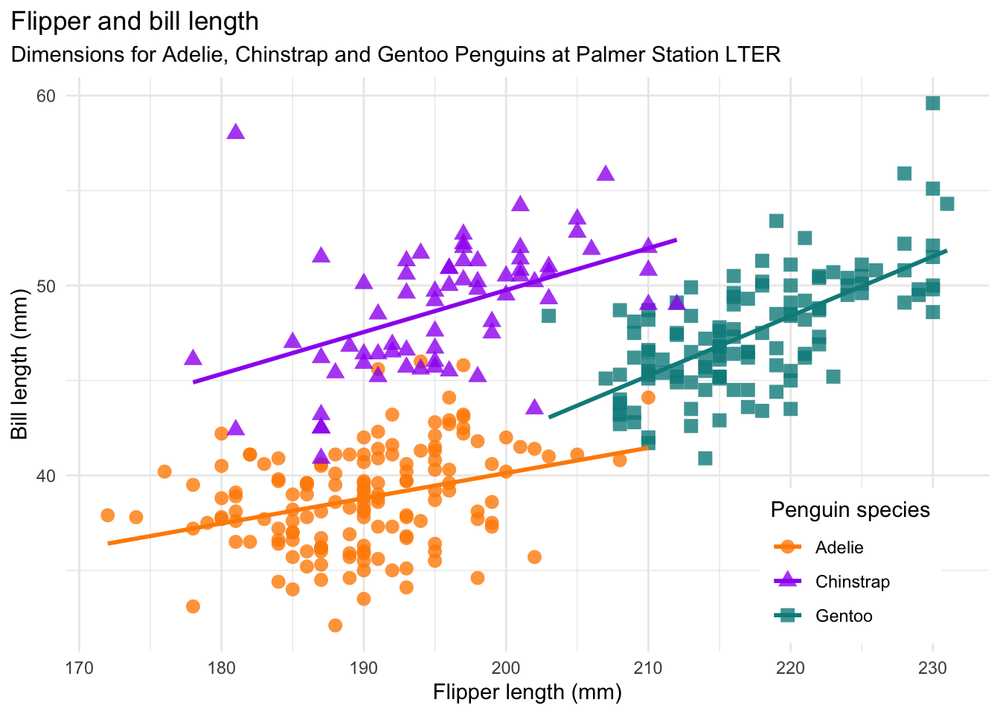

```{r setup}
#| message: False
#| warning: False
#| include: False
options(
  width=80
)

knitr::opts_chunk$set(
  fig.align = "center", fig.retina = 2, dpi = 150,
  out.width = "100%"
)

library(tidyverse)
library(palmerpenguins)
library(bslib)
```

#

{fig-align="center" width="40%"}


## The Grammar of Graphics

- Visualization concept created by Leland Wilkinson (The Grammar of Graphics, 1999)
- attempt to taxonomize the basic elements of statistical graphics


- Adapted for R by Hadley Wickham (2009)
  - consistent and compact syntax to describe statistical graphics
  
  - highly modular as it breaks up graphs into semantic components 
  
  - ggplot2 is not meant as a guide to which graph to use and how to best convey your data (more on that later), but it does have some strong opinions.


## Terminology

A statistical graphic is a...

- mapping of **data**

- which may be **statistically transformed** (summarized, log-transformed, etc.)

- to **aesthetic attributes** (color, size, xy-position, etc.)

- using **geometric objects** (points, lines, bars, etc.)

- and mapped onto a specific **facet** and **coordinate system**


## Anatomy of a ggplot call

::: {.xsmall}
```r
ggplot(
  data = [dataframe], 
  mapping = aes(
    x = [var x], y = [var y], 
    color = [var color], 
    shape = [var shape],
    ...
  )
) +
  geom_[some geom](
    mapping = aes(
      color = [var geom color],
      ...
    )
  ) +
  ... # other geometries
  scale_[some axis]_[some scale]() +
  facet_[some facet]([formula]) +
  ... # other options
```
:::

## Data - Palmer Penguins

Measurements for penguin species, island in Palmer Archipelago, size (flipper length, body mass, bill dimensions), and sex.

:::: {.columns}
::: {.column width='33%'}
{fig-align="center" width="100%"}
:::
::: {.column width='66%' .small}
```{r}
#| echo: False
options(width = 60)
```

```{r}
library(palmerpenguins)
penguins
```

```{r}
#| echo: False
options(width = 65)
```
:::
::::


# Text <-> Plot

##

::: {.xsmall}
> *Start with the `penguins` data frame*


```{r penguins-0}
#| code-line-numbers: "1"
#| output-location: column
#| warning: false
ggplot(data = penguins)
```
:::


##

::: {.xsmall}
> Start with the `penguins` data frame,
> *map bill depth to the x-axis*


```{r penguins-1}
#| code-line-numbers: "4"
#| output-location: column
#| warning: false
ggplot(
  data = penguins,
  mapping = aes(
    x = bill_depth_mm
  )
) 
```
:::


##

::: {.xsmall}
> Start with the `penguins` data frame,
> map bill depth to the x-axis
> *and map bill length to the y-axis.*


```{r penguins-2}
#| code-line-numbers: "5"
#| output-location: column
#| warning: false
ggplot(
  data = penguins,
  mapping = aes(
    x = bill_depth_mm,
    y = bill_length_mm
  )
)
```
:::


##

::: {.xsmall}
> Start with the `penguins` data frame,
> map bill depth to the x-axis
> and map bill length to the y-axis. 
> *Represent each observation with a point*


```{r penguins-3}
#| code-line-numbers: "8"
#| output-location: column
#| warning: false
ggplot(
  data = penguins,
  mapping = aes(
    x = bill_depth_mm,
    y = bill_length_mm
  )
) + 
  geom_point()
```
:::


##

::: {.xsmall}
> Start with the `penguins` data frame,
> map bill depth to the x-axis
> and map bill length to the y-axis. 
> Represent each observation with a point
> *and map species to the color of each point.*

```{r penguins-4}
#| code-line-numbers: "9"
#| output-location: column
#| warning: false
ggplot(
  data = penguins,
  mapping = aes(
    x = bill_depth_mm,
    y = bill_length_mm
  )
) + 
  geom_point(
    mapping = aes(color = species)
  )
```
:::


##

::: {.xsmall}
> Start with the `penguins` data frame,
> map bill depth to the x-axis
> and map bill length to the y-axis. 
> Represent each observation with a point
> and map species to the color of each point.
> *Title the plot "Bill depth and length"*


```{r penguins-5}
#| code-line-numbers: "11"
#| output-location: column
#| warning: false
ggplot(
  data = penguins,
  mapping = aes(
    x = bill_depth_mm,
    y = bill_length_mm
  )
) +
  geom_point(
    mapping = aes(color = species)
  ) +
  labs(title = "Bill depth and length")
```
:::


##

::: {.xsmall}
> Start with the `penguins` data frame,
> map bill depth to the x-axis
> and map bill length to the y-axis. 
> Represent each observation with a point
> and map species to the color of each point.
> Title the plot "Bill depth and length", 
> *add the subtitle "Dimensions for Adelie, Chinstrap, and Gentoo Penguins"*

```{r penguins-6}
#| code-line-numbers: "13-15"
#| output-location: column
#| warning: false
ggplot(
  data = penguins,
  mapping = aes(
    x = bill_depth_mm,
    y = bill_length_mm
  )
) +
  geom_point(
    mapping = aes(color = species)
  ) +
  labs(
    title = "Bill depth and length",
    subtitle = paste("Dimensions for Adelie,",
                     "Chinstrap, and Gentoo",
                     "Penguins")
  ) 
```
:::


##

::: {.xsmall}
> Start with the `penguins` data frame,
> map bill depth to the x-axis
> and map bill length to the y-axis. 
> Represent each observation with a point
> and map species to the color of each point.
> Title the plot "Bill depth and length", 
> add the subtitle "Dimensions for Adelie, Chinstrap, and Gentoo Penguins", 
> *label the x and y axes as "Bill depth (mm)" and "Bill length (mm)", respectively*

```{r penguins-7}
#| code-line-numbers: "16-17"
#| output-location: column
#| warning: false
ggplot(
  data = penguins,
  mapping = aes(
    x = bill_depth_mm,
    y = bill_length_mm
  )
) +
  geom_point(
    mapping = aes(color = species)
  ) +
  labs(
    title = "Bill depth and length",
    subtitle = paste("Dimensions for Adelie,",
                     "Chinstrap, and Gentoo",
                     "Penguins"),
    x = "Bill depth (mm)",
    y = "Bill length (mm)"
  )
```
:::


##

::: {.xsmall}
> Start with the `penguins` data frame,
> map bill depth to the x-axis
> and map bill length to the y-axis. 
> Represent each observation with a point
> and map species to the color of each point.
> Title the plot "Bill depth and length", 
> add the subtitle "Dimensions for Adelie, Chinstrap, and Gentoo Penguins", 
> label the x and y axes as "Bill depth (mm)" and "Bill length (mm)", respectively,
> *label the legend "Species"*

```{r penguins-8}
#| code-line-numbers: "18"
#| output-location: column
#| warning: false
ggplot(
  data = penguins,
  mapping = aes(
    x = bill_depth_mm,
    y = bill_length_mm
  )
) +
  geom_point(
    mapping = aes(color = species)
  ) +
  labs(
    title = "Bill depth and length",
    subtitle = paste("Dimensions for Adelie,",
                     "Chinstrap, and Gentoo",
                     "Penguins"),
    x = "Bill depth (mm)",
    y = "Bill length (mm)",
    color = "Species"
  ) 
```
:::


##

::: {.xsmall}
> Start with the `penguins` data frame,
> map bill depth to the x-axis
> and map bill length to the y-axis. 
> Represent each observation with a point
> and map species to the color of each point.
> Title the plot "Bill depth and length", 
> add the subtitle "Dimensions for Adelie, Chinstrap, and Gentoo Penguins", 
> label the x and y axes as "Bill depth (mm)" and "Bill length (mm)", respectively,
> label the legend "Species", 
> *and add a caption for the data source.*

```{r penguins-9}
#| code-line-numbers: "19"
#| output-location: column
#| warning: false
ggplot(
  data = penguins,
  mapping = aes(
    x = bill_depth_mm,
    y = bill_length_mm
  )
) +
  geom_point(
    mapping = aes(color = species)
  ) +
  labs(
    title = "Bill depth and length",
    subtitle = paste("Dimensions for Adelie,",
                     "Chinstrap, and Gentoo",
                     "Penguins"),
    x = "Bill depth (mm)",
    y = "Bill length (mm)",
    color = "Species",
    caption = "Source: palmerpenguins package"
  )
```
:::


##

::: {.xsmall}
> Start with the `penguins` data frame,
> map bill depth to the x-axis
> and map bill length to the y-axis. 
> Represent each observation with a point
> and map species to the color of each point.
> Title the plot "Bill depth and length", 
> add the subtitle "Dimensions for Adelie, Chinstrap, and Gentoo Penguins", 
> label the x and y axes as "Bill depth (mm)" and "Bill length (mm)", respectively,
> label the legend "Species", 
> and add a caption for the data source.
> *Finally, use the viridis color palette for all points.*

```{r penguins-10}
#| code-line-numbers: "21"
#| output-location: column
#| warning: false
ggplot(
    data = penguins,
    mapping = aes(
      x = bill_depth_mm,
      y = bill_length_mm
    )
  ) +
    geom_point(
      mapping = aes(color = species)
    ) +
    labs(
      title = "Bill depth and length",
      subtitle = paste("Dimensions for Adelie,",
                       "Chinstrap, and Gentoo",
                       "Penguins"),
      x = "Bill depth (mm)",
      y = "Bill length (mm)",
      color = "Species",
      caption = "Source: palmerpenguins package"
    ) +
    scale_color_viridis_d()
```
:::


# Aesthetics


## Aesthetics options

Commonly used characteristics of plotting geometries that can be **mapped to a specific variable** in the data, examples include:

- position (`x`, `y`)
- `color`
- `shape`
- `size`
- `alpha` (transparency)

Different geometries have different aesthetics available - see the [ggplot2 geoms](https://ggplot2.tidyverse.org/reference/index.html#Geoms) help files for listings.


* Aesthetics given in `ggplot()` apply to all `geom`s.

* Aesthetics for a specific `geom_*()` can be overridden via `mapping` or as an argument.


## color

::: {.xsmall}
```{r color}
#| out-width: 75%
ggplot(
  penguins, aes(x = bill_depth_mm, y = bill_length_mm)
) + 
  geom_point(
    aes(color = species)
  )
```
:::


## Stop the warning

::: {.xsmall}
```{r color_narm}
#| out-width: 75%
ggplot(
  penguins, aes(x = bill_depth_mm, y = bill_length_mm)
) + 
  geom_point(
    aes(color = species), na.rm=TRUE
  )
```
:::


## Shape

Mapped to a different variable than `color`

::: {.xsmall}
```{r shape-island}
#| out-width: 75%
ggplot(
  penguins, aes(x = bill_depth_mm, y = bill_length_mm)
) +
  geom_point(
    aes(color = species, shape = island), na.rm = TRUE
  )
```
:::


## Shape

Mapped to same variable as `color`

::: {.xsmall}
```{r shape-species}
#| out-width: 75%
ggplot(
  penguins, aes(x = bill_depth_mm, y = bill_length_mm)
) +
  geom_point(
    aes(color = species, shape = species), na.rm = TRUE
  )
```
:::


## Size

Using a fixed value - note that this value is outside of the `aes` call

::: {.xsmall}
```{r size1}
#| out-width: 66%
ggplot(
  penguins, aes(x = bill_depth_mm, y = bill_length_mm)
) +
  geom_point(
    aes(color = species, shape = species), na.rm = TRUE,
    size = 3
  )
```
:::


## Size

Mapped to a variable

::: {.xsmall}
```{r size2}
#| out-width: 66%
ggplot(
  penguins, aes(x = bill_depth_mm, y = bill_length_mm)
) +
  geom_point(
    aes(color = species, shape = species, size = body_mass_g), na.rm = TRUE
  )
```
:::


## Alpha

::: {.xsmall}
```{r alpha}
#| out-width: 75%
ggplot(
  penguins,
  aes(x = bill_depth_mm, y = bill_length_mm)
) +
  geom_point(
    aes(color = species, shape = species, alpha = body_mass_g), na.rm = TRUE,
    size = 3
  )
```
:::


## Mapping vs settings

- **Mapping** - Determine an aesthetic (the size, alpha, etc.) of a geom based on the values of a variable in the data
  - wrapped by `aes()` and pass as `mapping` argument to `ggplot()` or `geom_*()`.

<br/>

- **Setting** - Determine an aesthetic (the size, alpha, etc.) of a geom using a constant value not directly from the data.
  - passed directly into `geom_*()` as an argument.

. . .

<br/>

From the previous slide `color`, `shape`, and `alpha` are all **aesthetics** while `size` was a **setting**.

# Labels

## `labs()`

In our previous example we saw the use of `labs()` to human readable labels to various plot components.

We it comes to out aesthetics (data) we can annotate the data so that the label is generated automatically, by attaching a `label` argument to the appropriate column in our data frame.

::: {.xxsmall}
```{r}
#| output-location: column
ggplot(
  data = penguins,
  mapping = aes(
    x = bill_depth_mm,
    y = bill_length_mm
  )
) +
  geom_point(
    mapping = aes(color = species), na.rm = TRUE
  ) +
  labs(
    title = "Bill depth and length",
    subtitle = paste(
      "Dimensions for Adelie,",
      "Chinstrap, and Gentoo",
      "Penguins"),
    x = "Bill depth (mm)",
    y = "Bill length (mm)",
    color = "Species",
    caption = "Source: palmerpenguins package"
  )
```
:::

## Labels

::: {.xxsmall}
```{r}
#| output-location: column

p_labeled = penguins
attr(p_labeled$species, "label") = "Species"
attr(p_labeled$bill_depth_mm, "label") = "Bill depth (mm)"
attr(p_labeled$bill_length_mm, "label") = "Bill length (mm)"

ggplot(
  data = p_labeled,
  mapping = aes(
    x = bill_depth_mm,
    y = bill_length_mm
  )
) +
  geom_point(
    mapping = aes(color = species), na.rm = TRUE
  ) +
  labs(
    title = "Bill depth and length",
    subtitle = paste(
      "Dimensions for Adelie,",
      "Chinstrap, and Gentoo",
      "Penguins"),
    caption = "Source: palmerpenguins package"
  )
```
:::

. . .

The benefit of this approach is that the labels are now part of the data frame and will be used automatically in future plots. Define once, use repeatedly.

## Dictionary

Alternatively, we can provide a dictionary / lookup table to `labs()` dictionary, which will then be used.

::: {.xxsmall}
```{r}
#| output-location: column

lookup = c(
  species = "Species",
  bill_depth_mm = "Bill depth {mm}",
  bill_length_mm = "Bill length {mm}"
)

ggplot(
  data = penguins,
  mapping = aes(
    x = bill_depth_mm,
    y = bill_length_mm
  )
) +
  geom_point(
    mapping = aes(color = species), na.rm = TRUE
  ) +
  labs(
    title = "Bill depth and length",
    subtitle = paste(
      "Dimensions for Adelie,",
      "Chinstrap, and Gentoo",
      "Penguins"),
    caption = "Source: palmerpenguins package",
    dictionary = lookup
  )
```
:::

# Faceting


## Faceting

- Smaller plots that display different subsets of the data

- Useful for exploring conditional relationships and large data

- Sometimes referred to as "small multiples"


## facet_grid

::: {.xsmall}
```{r facet}
#| out-width: 75%
ggplot(
  penguins, aes(x = bill_depth_mm, y = bill_length_mm)
) + 
  geom_point(na.rm = TRUE) +
  facet_grid(
    species ~ island
  )  
```
:::


## Compare with ...

::: {.xsmall}
```{r facet_comp}
#| out-width: 75%
ggplot(
  penguins, aes(x = bill_depth_mm, y = bill_length_mm)
) + 
  geom_point(
    aes(color = species, shape = island), na.rm = TRUE, size = 3
  )
```
:::

## Faceting and color

::: {.xsmall}
```{r facet-color-legend}
#| out-width: 75%
ggplot(
  penguins, aes(x = bill_depth_mm, y = bill_length_mm, color = species)
) +
  geom_point(na.rm = TRUE) +
  facet_grid(species ~ island)
```
:::


## Hiding legend elements

::: {.xsmall}
```{r facet-color-no-legend}
#| out-width: 75%
#| code-line-numbers: "6"
ggplot(
  penguins, aes(x = bill_depth_mm, y = bill_length_mm, color = species)
) +
  geom_point(na.rm = TRUE) +
  facet_grid(species ~ island) +
  guides(color = "none")
```
:::


## Facet layout - context

::: {.xsmall}
```{r facet-layout-context}
#| out-width: 75%
#| code-line-numbers: "4"
ggplot(
  penguins, aes(x = bill_depth_mm, y = bill_length_mm, color = species)
) +
  geom_point(color = "grey", alpha = 0.5, na.rm = TRUE, layout = "fixed") +
  geom_point(na.rm = TRUE) +
  facet_grid(species ~ island) +
  guides(color = "none")
```
:::

## Facet layout - annotation

::: {.xxsmall}
```{r facet-layout-text}
#| out-width: 75%
#| code-line-numbers: "8-15"
ggplot(
  penguins, aes(x = bill_depth_mm, y = bill_length_mm, color = species)
) +
  geom_point(color = "grey", alpha = 0.5, na.rm = TRUE, layout = "fixed") +
  geom_point(na.rm = TRUE) +
  facet_grid(species ~ island) +
  guides(color = "none") +
  geom_text(
    x = 17.5, y = 35, label = "Only sampled on Dream", size = 6, color = "black", 
    layout = 5
  ) +
  geom_text(
    x = 17.5, y = 35, label = "Only sampled on Biscoe", size = 6, color = "black", 
    layout = 7
  )
```
:::

## Facet axes

::: {.xsmall}
```{r facet-axes}
#| out-width: 75%
#| code-line-numbers: "6"
ggplot(
  penguins, aes(x = bill_depth_mm, y = bill_length_mm, color = species)
) +
  geom_point(color = "grey", alpha = 0.5, na.rm = TRUE, layout = "fixed") +
  geom_point(na.rm = TRUE) +
  facet_grid(species ~ island, axes = "all") +
  guides(color = "none")
```
:::

## Facet axes - labels

::: {.xsmall}
```{r facet-axes-labels}
#| out-width: 75%
#| #| code-line-numbers: "6"
ggplot(
  penguins, aes(x = bill_depth_mm, y = bill_length_mm, color = species)
) +
  geom_point(color = "grey", alpha = 0.5, na.rm = TRUE, layout = "fixed") +
  geom_point(na.rm = TRUE) +
  facet_grid(species ~ island, axes = "all", axis.labels = "margins") +
  guides(color = "none")
```
:::

## facet_grid (columns)

::: {.xsmall}
```{r facet2}
#| out-width: 75%
ggplot(
  penguins, aes(x = bill_depth_mm, y = bill_length_mm)
) + 
  geom_point(na.rm = TRUE) +
  facet_grid(~ species)  
```
:::


## facet_grid (rows)

::: {.xsmall}
```{r facet3}
#| out-width: 75%
ggplot(
  penguins, aes(x = bill_depth_mm, y = bill_length_mm)
) + 
  geom_point(na.rm = TRUE) +
  facet_grid(species ~ .)  
```
:::


## facet_wrap

::: {.xsmall}
```{r facetwrap}
#| out-width: 75%
ggplot(
  penguins, aes(x = bill_depth_mm, y = bill_length_mm)
) + 
  geom_point(na.rm = TRUE) +
  facet_wrap(~ species)
```
:::


## facet_wrap

::: {.xsmall}
```{r facetwrap2}
#| out-width: 75%
ggplot(
  penguins, aes(x = bill_depth_mm, y = bill_length_mm)
) + 
  geom_point(na.rm = TRUE) +
  facet_wrap(~ species, ncol = 2)
```
:::


## facet_wrap - direction

::: {.xsmall}
```{r facetwrap2-dir}
#| out-width: 75%
ggplot(
  penguins, aes(x = bill_depth_mm, y = bill_length_mm)
) + 
  geom_point(na.rm = TRUE) +
  facet_wrap(~ species, ncol = 2, dir = "br")
```
:::

## facet_wrap - direction

::: {.xsmall}
```{r facetwrap2-dir2}
#| out-width: 75%
ggplot(
  penguins, aes(x = bill_depth_mm, y = bill_length_mm)
) + 
  geom_point(na.rm = TRUE) +
  facet_wrap(~ species, ncol = 2, dir = "rb")
```
:::

# Learning more

## geom tour

::: {.large .center}
[ggplot2.tidyverse.org/reference/index.html](https://ggplot2.tidyverse.org/reference/index.html)
:::


<iframe data-src="https://ggplot2.tidyverse.org/reference/index.html" width="100%" height="500px" style="border:1px solid;border-radius: 5px;" data-external="1">
</iframe>

# Exercises

## Exercise 1

Recreate, as faithfully as possible, the following plot using ggplot2 and the `penguins` data.

```{r echo = FALSE, out.width = "60%", fig.height = 5}
penguins |>
  filter(!is.na(sex)) |>
  ggplot(
    aes(
      x = body_mass_g,
      fill = species
    ) 
  ) +
  geom_density(alpha = 0.5, color = NA) +
  facet_wrap(~sex, nrow = 2) + 
  labs(
    x = "Body Mass (g)",
    y = "",
    fill = "Species"
  )
```


## Exercise 2

Recreate, as faithfully as possible, the following plot from the `palmerpenguin` package README in ggplot2.

```{r echo = FALSE, out.width="55%"}

```

::: {.aside}
See the `palmerpenguins` pkgdown [site](https://allisonhorst.github.io/palmerpenguins/)
:::
