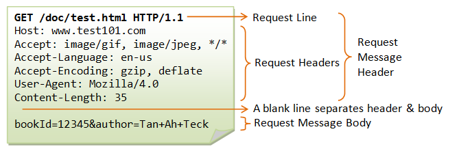
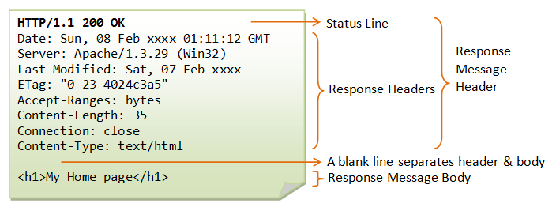

```{r setup}
#| message: False
#| warning: False
#| include: False
options(
  width=80
)

knitr::opts_chunk$set(
  fig.align = "center", fig.retina = 2, dpi = 150,
  out.width = "100%",
  message = TRUE
)

library(tidyverse )
library(rvest)
```


## URLs

{fig-align="center" width="100%"}


::: {.aside}
From [HTTP: The Protocol Every Web Developer Must Know](http://code.tutsplus.com/tutorials/http-the-protocol-every-web-developer-must-know-part-1--net-31177)
:::


## Query Strings

Provides named parameter(s) and value(s) that modify the behavior of the resulting page. 

<br/>

Format generally follows:

::: {.center .large}
`?arg1=value1&arg2=value2&arg3=value3`
:::

. . .

<br/>

Some quick examples,

::: {.small}
* <http://maps.googleapis.com/maps/api/geocode/json?sensor=false&address=1600+Amphitheatre+Parkway>

* <https://swapi.dev/api/people/?search=r2>
:::


## URL encoding

This is will often be handled automatically by your web browser or other tool, but it is useful to know a bit about what is happening

* Spaces will encoded as '+' or '%20'

* Certain characters are reserved and will be replaced with the percent-encoded version within a URL

::: {.small}
| !   | #   | $   | &   | '   | (   | )   |
|:---:|:---:|:---:|:---:|:---:|:---:|:---:|
| %21 | %23 | %24 | %26 | %27 | %28 | %29 |
| *   | +   | ,   | /   | :   | ;   | =   |
| %2A | %2B | %2C | %2F | %3A | %3B | %3D |
| ?   | @   | [   | ]   |
| %3F | %40 | %5B | %5D |
:::

* Characters that cannot be converted to the correct charset are replaced with HTML numeric character references (e.g. a &#931; would be encoded as &amp;#931; )

## Examples


::: {.small}
```{r}
URLencode("http://lmgtfy.com/?q=hello world")
URLdecode("http://lmgtfy.com/?q=hello%20world")
```
:::

. . .

::: {.small}
```{r}
URLencode("!#$&'()*+,/:;=?@[]")
URLencode("!#$&'()*+,/:;=?@[]", reserved = TRUE)
URLencode("!#$&'()*+,/:;=?@[]", reserved = TRUE) |> 
  URLdecode()
```
:::

. . .

::: {.small}
```{r}
URLencode("Σ")
URLdecode("%CE%A3")
```
:::


# RESTful APIs

## REST

*RE*presentational *S*tate *T*ransfer

* Describes an architectural style for web services (not a standard)

* All communication via HTTP requests and responses

* Key features:
    - **Client-server architecture** - separation of concerns between client and server
    - **Stateless** - each request contains all information needed; no session state stored on server
    - **Addressable** - resources identified by URLs (endpoints)
    - **Uniform interface** - standard HTTP methods (GET, POST, PUT, DELETE)
    - **Cacheable** - responses can be cached to improve performance
    - **Layered system** - client cannot tell if connected directly to server or intermediary

* Resources are represented in standard formats (typically JSON or XML)


## GitHub API

GitHub provides a REST API that allows you to interact with most of the data available on the website.

There is extensive documentation and a huge number of endpoints to use - almost anything that can be done on the website can also be done via the API.

::: {.center}
[GitHub REST API](https://docs.github.com/en/rest)
:::


## Demo 1 - GitHub API <br/> Basic access 

<br/><br/>

::: {.center}
[Get a user](https://docs.github.com/en/rest/users/users?apiVersion=2022-11-28#get-a-user)

[List organization repositories](https://docs.github.com/en/rest/repos/repos?apiVersion=2022-11-28#list-organization-repositories)
:::

## Pagination

Many REST APIs limit the number of results returned in a single response to manage server load and improve performance. When working with large datasets, you'll need to make multiple requests to retrieve all results.

Common pagination approaches:

* Offset-based - specify starting position and number of items (`?offset=20&limit=10`)

* Page-based - specify page number and page size (`?page=2&per_page=30`)

* Cursor-based - use a token/cursor pointing to next set of results

* Link header - server provides URLs to next/previous pages in response headers

::: aside
The point is that there is no single standard for pagination in (REST) APIs, so always refer to the specific API documentation for details.
:::

## GitHub API Pagination

GitHub uses page-based and link header pagination:

* Query parameters:
    - `per_page` - number of items per page (default: 30, max: 100)
    - `page` - page number to retrieve (default: 1)

* Link header: GitHub includes a `Link` header in responses with URLs for:
    - `next` - next page of results
    - `prev` - previous page
    - `first` - first page
    - `last` - last page


# httr2

## Background

`httr2` is a package designed around the construction and handling of HTTP requests and responses. It is a rewrite of the `httr` package and includes the following features:

* Pipeable API

* Explicit request object, with support for

    * rate limiting
    
    * retries
    
    * OAuth
    
    * Secure secret storage

* Explicit response object, with support for

    * error codes / reporting
    
    * common body encoding (e.g. json, etc.)


## Structure of an HTTP Request

<br/>

{fig-align="center" width="100%"}

::: {.aside}
[Source](https://www3.ntu.edu.sg/home/ehchua/programming/webprogramming/http_basics.html)
:::

## HTTP Methods / Verbs

* *GET* - fetch a resource

* *POST* - create a new resource

* *PUT* - full update of a resource

* *PATCH* - partial update of a resource

* *DELETE* - delete a resource.

Less common verbs: *HEAD*, *TRACE*, *OPTIONS*.

::: {.aside}
Based on [HTTP: The Protocol Every Web Developer Must Know](http://code.tutsplus.com/tutorials/http-the-protocol-every-web-developer-must-know-part-1--net-31177)
:::


## httr2 request objects

A new request object is constructed via `request()` which is then modified via `req_*()` functions

Some useful functions:

* `request()` - initialize a request object

* `req_method()` - set HTTP method

* `req_url_query()` - add query parameters to URL

* `req_url_*()` - add or modify URL

* `req_body_*()` - set body content (various formats and sources)

* `req_user_agent()` - set user-agent

* `req_dry_run()` - shows the exact request that will be made


## Structure of an HTTP Response

<br/>

{fig-align="center" width="100%"}

::: {.aside}
[Source](https://www3.ntu.edu.sg/home/ehchua/programming/webprogramming/http_basics.html)
:::

## Status Codes

* 1xx: Informational Messages

* 2xx: Successful

* 3xx: Redirection

* 4xx: Client Error

* 5xx: Server Error


## httr2 response objects

Once constructed a request is made via `req_perform()` which returns a response object (the most recent response can also be retrieved via `last_response()`). Content of the response are accessed via the `resp_*()` functions

Some useful functions:

* `resp_status()` - extract HTTP status code 

* `resp_status_desc()` - return a text description of the status code

* `resp_content_type()` - extract content type and encoding

* `resp_body_*()` - extract body from a specific format (`json`, `html`, `xml`, etc.)

* `resp_headers()` - extract response headers


# Demo 2 - httr2 + GitHub


## Authentication

Most APIs have rate limits and access restrictions:

* Unauthenticated requestss - limited rate limits, restricted access
* Authenticated requests - higher rate limits, access to private resources

GitHub API rate limits (per hour):

* Unauthenticated: 60 requests
* Authenticated: 5,000 requests (personal access token)

Authentication is done via HTTP headers, typically:

* `Authorization: Bearer <token>`

::: aside
Here `Authorization` is the request header and `Bearer <token>` is the value. With `httr2` `req_auth_bearer_token()` can be used to add this header.
:::


## GitHub Personal Access Tokens (PATs)

A PAT is a secure alternative to using passwords for API authentication:

* Generated on GitHub: Settings → Developer settings → Personal access tokens
* Choose scopes (permissions) carefully - only grant what's needed
* Two types:
    - Fine-grained tokens - repository-specific access (recommended)
    - Classic tokens - broader access patterns

Best practices:

* Never commit tokens to git repositories
* Store in environment variables (e.g., `.Renviron`)
* Use packages like `gitcreds` or `credentials` to manage tokens securely
* Set expiration dates and rotate tokens regularly


