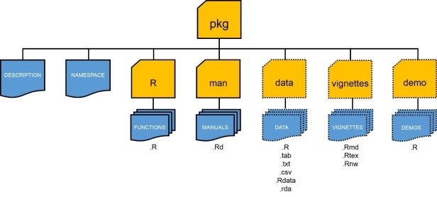
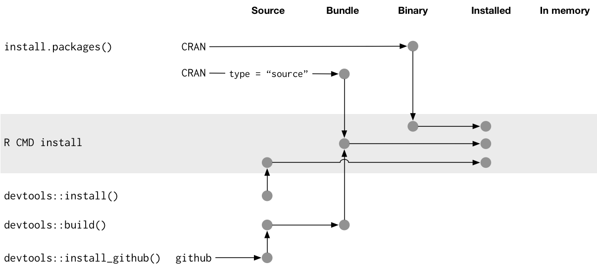
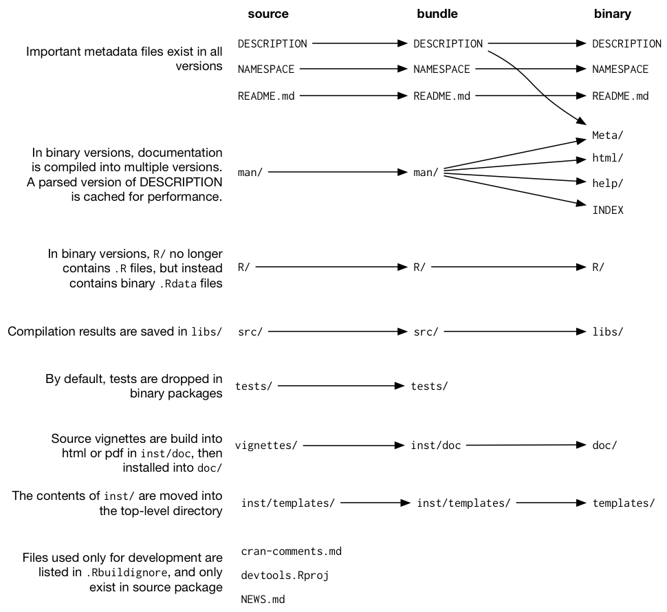

```{r setup}
#| message: False
#| warning: False
#| include: False
knitr::opts_chunk$set(
  fig.align = "center", fig.retina = 2, dpi = 150
)

options(width=50)
options(tibble.width = 50)
```

## What are R packages?

R packages are just a collection of files - R code, compiled code (C, C++, etc.), data, documentation, and others that live in your library path.

. . .

::: {.xsmall}
```{r}
.libPaths()
```
:::

. . .

::: {.xsmall}
```{r}
dir(.libPaths())
```
:::

## Search path

When you run `library(pkg)` the functions (and objects) in the package's namespace are attached to the global search path.

::: {.xsmall}
```{r}
search()
```
:::

. . .

::: {.xsmall}
```{r}
library(diffmatchpatch)
```
:::

. . .

::: {.xsmall}
```{r}
search()
```
:::


## Loading vs attaching

If you do not want to attach a package you can directly *load* the package with `requireNamespace()`. 

:::: {.columns .xxsmall}
::: {.column width='33%'}
```{r}
loadedNamespaces()
```
:::

::: {.column width='33%' .fragment}
```{r}
requireNamespace("forcats")
loadedNamespaces()
```

:::

::: {.column width='33%' .fragment}
```{r}
search()
```
:::
::::

::: aside
`requireNamespace()` also returns `TRUE` or `FALSE` depending on if it succeeds - it can be used to test if a package is available.
:::

## Automatic loading

Using a package function via `::` will automatically *load* the package (and its dependencies) but not *attach* it to the search path.

:::: {.columns .xxsmall}
::: {.column width='33%'}
```{r}
loadedNamespaces()
```
:::

::: {.column width='33%' .fragment}
```{r}
dplyr::lag(1:3)
loadedNamespaces()
```

:::

::: {.column width='33%' .fragment}
```{r}
search()
```
:::
::::


## Where do R packages come from?

Generally from somewhere on the internet, most commonly from CRAN or GitHub, the methods for installing from these locations are slightly different.

#### CRAN:

::: {.xsmall}
```{r}
#| eval: False
install.packages("diffmatchpatch")
```
:::

#### GitHub:

::: {.xsmall}
```{r}
#| eval: False
remotes::install_github("rundel/diffmatchpatch")
```
:::

::: {.fragment}

there is one other method that comes up (particularly around package development), which is to install a package from local file(s).

#### Local install:

From the terminal,

::: {.xsmall}
```{bash eval=FALSE}
R CMD install diffmatchpatch_0.1.0.tar.gz
```
:::

or from R,

::: {.xsmall}
```{r}
#| eval: False
devtools::install("diffmatchpatch_0.1.0.tar.gz")
```
:::

:::

## What is CRAN

The Comprehensive R Archive Network is the central repository of R packages.

* Maintained by the R Foundation and run by a team of volunteers, ~23k packages 

* Contains all *current* versions of released packages as well as previous releases (including archived packages)

* Similar in spirit to Perl's CPAN, TeX's CTAN, and Python's PyPI

* Some important features:
  
  * All submissions are reviewed by humans + automated checks
  
  * Strictly enforced submission policies and package requirements
  
  * All packages must be actively maintained and support upstream and downstream changes

::: {.aside}
See [Writing R Extensions](https://cran.r-project.org/doc/manuals/r-release/R-exts.html)
:::

## Structure of an R Package

<br/>
<br/>

{fig-align="center" width="100%"}

::: {.aside}
From [A Quickstart Guide for Building Your First R Package](https://methodsblog.com/2015/11/30/building-your-first-r-package/)
:::

## Core components

* `DESCRIPTION` - file containing package metadata (e.g. package name, description, version, license, and author details). Also specifies package dependencies.

* `NAMESPACE` - details which functions and objects are exported by your package.

* `R/` - contains all R script files (`.R`) implementing package

* `man/` - contains all R documentation files (`.Rd`)


## Optional components

The following components are optional, but quite common:

* `tests/` - contains unit tests (`.R` scripts)

* `src/` - contains code to be compiled (usually C / C++)

* `data/` - contains example data sets (`.rds` or `.rda`)

* `inst/` - contains files that will be copied to the package's top-level directory when it is installed (e.g. C/C++ headers, examples or data files that don't belong in `data/`)

* `vignettes/` - contains long form documentation, can be static (`.pdf` or `.html`) or literate documents (e.g. `.qmd`, `.Rmd` or `.Rnw`)


## Package contents

:::: {.columns .xxsmall}
::: {.column width='50%'}
Source Package
```{r}
fs::dir_tree("~/Desktop/Projects/diffmatchpatch/")
```
:::

::: {.column width='50%'}
Installed Package
```{r}
fs::dir_tree(system.file(package="diffmatchpatch"))
```
:::
::::

## Package Installation

{fig-align="center" width="80%"}

::: {.aside}
R Packages (1e) - Chap. 4
:::

## Package Installion - Files {.scrollable}

{fig-align="center" width="100%"}

<!-- {fig-align="center" width="55%"} -->

::: {.aside}
From [R Packages (2e) - Chap. 3.3](https://r-pkgs.org/structure.html#sec-bundled-package)
:::


## Package development

What follows is an *opinionated* introduction to package development, 

* this is not the only way to do thing (none of the following tools are required)

* We strongly recommend using:
  * RStudio
  * RStudio projects
  * GitHub
  * usethis
  * roxygen2

* Read and follow along with R Packages (2e) - [Chapter 1 - "The Whole Game"](https://r-pkgs.org/whole-game.html)

#

{fig-align="center" width="40%"}

## `usethis`

This is an immensely useful package for automating all kinds of routine (and tedious) tasks within R

* Tools for managing git and GitHub configuration

* Tools for managing collaboration on GitHub via pull requests (see `pr_*()`)

* Tools for creating and configuring packages

* Tools for configuring your R environment (e.g. `.Rprofile` and `.Renviron`)

* and much much more


# Live demo <br/> Building a Package

## Start your package

Rather than having to remember all of the necessary pieces and their format, `usethis` can help you bootstrap your package development process.

```{r}
#| eval: false
usethis::create_package()
```


::: {.aside}
`available::available()` can be used to check if your proposed packagename is available.
:::

## Choosing a license

An important early step in developing a package is choosing a license - this is not trivial but is important to do early on, particularly if collaborating with others.

There are many resources available to help you choose a license, including:

::: {.center .large}
<https://choosealicense.com/>
:::

## Documentation

All R packages are expected to have documentation for all *exported* functions and data sets (this is a CRAN requirement). This documentation is stored as `.Rd` files in the `man/` directory.

* The Rd format is a markup language that is loosely based on LaTeX

* Rd files are processed into LaTeX, HTML, and plain text when building the package

* All packages need Rd files, that doesn't mean you need to write Rd

## Roxygen2

> The premise of roxygen2 is simple: describe your functions in comments next to their definitions and roxygen2 will process your source code and comments to automatically generate `.Rd` files in `man/`, `NAMESPACE`, and, if needed, the `Collate` field in `DESCRIPTION.`

* roxygen uses special comment lines prefixed with `#'`

* roxygen specific command have the format `@cmd` and mostly match `Rd` commands

* `devtools::document()` or menu `Build > Document` with reprocess all source files and rebuild all `Rd`s

* `usethis::create_package()` with `roxygen = TRUE` will initialize your package to use roxygen (default behavior)


# Package vigenette(s)

## Vignette

Long form documentation for your package that live in `vignette/`, use `browseVignette(pkg)` to see a package's vignettes.

* Not required, but adds a lot of value to a package

* Generally these are literate documents (`.Rmd`, `.Rnw`) that are compiled to `.html` or `.pdf` when the package is built. 

* Built packages retain the rendered document, the source document, and all source code

  * `vignette("colwise", package = "dplyr")` opens rendered version

  * `edit(vignette("colwise", package = "dplyr"))` opens code chunks

* Use `usethis::use_vignette()` to create a RMarkdown vignette template


## Articles

These are an un-official extension to vignettes where package authors wish to include additional long form documentation that is included in their `pkgdown` site but not in the package (usually for space reasons).

* Use `usethis::use_article()` to create

* Files are added to `vignette/articles/` which is added to `.Rbuildignore`


# Package data


## Exported data

Many packages contain sample data (e.g. `nycflights13`, `babynames`, etc.)

Generally these files are made available by saving a single data object as an `.Rdata` file (using `save()`) into the `data/` directory of your package.

* An easy option is to use `usethis::use_data(obj)` to create the necessary file(s)

* Data is usually compressed, for large data sets it may be worth trying different options (there is a 5 Mb package size limit on CRAN)

* Exported data must be documented (possible via roxygen)

## Lazy data

By default when attaching a package all of that packages data is loaded - however if `LazyData: true` is set in the packages' `DESCRIPTION` then data is only loaded when used.

. . .

::: {.small}
```{r}
pryr::mem_used()
```
:::

. . .

::: {.small}
```{r}
library(nycflights13)
pryr::mem_used()
```
:::

. . .

::: {.small}
```{r}
invisible(flights)
pryr::mem_used()
```
:::


If you use `usethis::use_data()` this option will be set in `DESCRIPTION` automatically.


## Raw data

When published a package should generally only contain the final data set, but it is important that the process to generate the data is documented as well as any necessary preliminary data.

* These can live any where but the general suggestion is to create a `data-raw/` directory which is included in `.Rbuildignore`

* `data-raw/` then contain scripts, data files, and anything else needed to generate the final object

* See examples [babynames](https://github.com/hadley/babynames) or [nycflights](https://github.com/hadley/nycflights13)

* Use `usethis::use_data_raw()` to create and ignore the `data-raw/` directory.


## Internal data

If you have data that you want to have access to from within the package but not exported then it needs to live in a special Rdata object located at `R/sysdata.rda`.

* Can be created using `usethis::use_data(obj1, obj2, internal = TRUE)`

* Each call to the above will overwrite, so needs to include all objects

* Not necessary for small data frames and similar objects - just create in a script. Use when you want the object to be compressed.

* Example [nflplotR](https://github.com/nflverse/nflplotR/tree/main/R) which contains team logos and colors for NFL teams.


## Raw data files

If you want to include raw data files (e.g `.csv`, shapefiles, etc.) there are generally placed in `inst/` (or a nested folder) so that they are installed with the package.

* Accessed using `system.file("dir", package = "package")` after install

* Use folders to keep things organized, Hadley recommends and uses `inst/extdata/` 

* Example [sf](https://github.com/r-spatial/sf/tree/master/inst)


