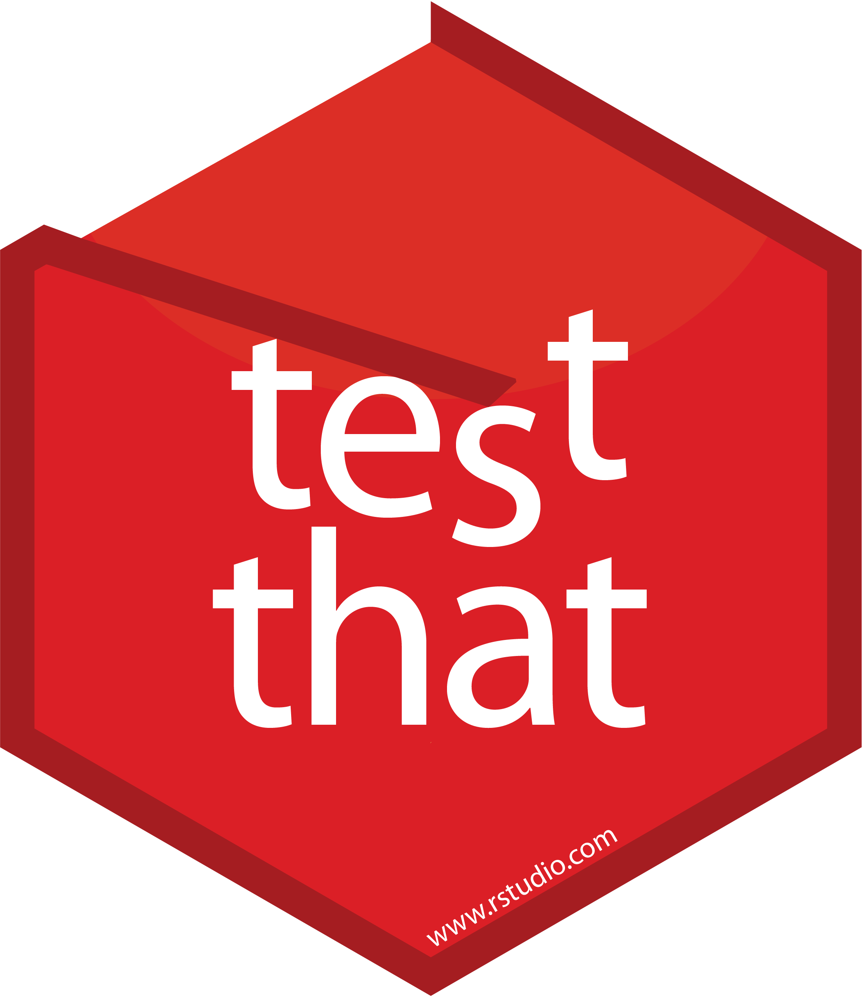

```{r setup}
#| message: False
#| warning: False
#| include: False
knitr::opts_chunk$set(
  fig.align = "center", fig.retina = 2, dpi = 150
)

options(width=50)
options(tibble.width = 50)
```

# Package checking

## `R CMD check`

Last time we saw the usage of `R CMD check`, or rather `Build > Check Package` from within RStudio.

This is a good idea to run regularly to make sure nothing is broken and you are meeting the important package quality standards, but this only in the context of your machine, your version of R, your OS, and so on.

If using GitHub it is highly recommended that you run `usethis::use_github_action_check_standard()` to enable GitHub actions checks of the package each time it is pushed.

On each push this runs R CMD check on:
  * Latest R on MacOS, Windows, Linux (Ubuntu)
  * Previous and devel version of R on Linux (Ubuntu)


# Package testing


## Basic test structure 

Package tests live in `tests/`, 

* Any R scripts found in the folder will be run when Checking the package (not Building)

* Generally tests fail on errors, but warnings are also tracked

* Testing is possible via base R, including comparison of output vs. a file but it is not recommended (See [Writing R Extensions](https://cran.r-project.org/doc/manuals/r-release/R-exts.html#Package-subdirectories))

* Note that R CMD check also runs all documentation examples (unless explicitly tagged dont run) - which can be used for basic testing

##

{fig-align="center" width="40%"}

## testthat basics

Not the only option but probably the most widely used and with the best integration into RStudio.

Can be initialized in your project via `usethis::use_testthat()` which creates `tests/testthat/` and some basic scaffolding.

* `test/testthat.R` is what is run by R CMD Check and runs your other tests - handles some basic config like loading package(s)

* Test scripts go in `tests/testthat/` and should start with `test_`, suffix is usually the file in `R/` that is being tested. 


::: {.aside}
`usethis::use_testthat()` has an edition argument, this is a way of maintaining backwards compatibility, generally always use the latest edition if starting a new project
:::


## testthat script structure

From the bottom up,

* a single test is written as an expectation (e.q. `expect_equal()`, `expect_error()`, etc.)

* multiple related expectations are combined into a test group (`test_that()`), which provides
  * a human readable name and
  * local scope to contain the expectations and any temporary objects
  
* multiple test groups are combined into a file


