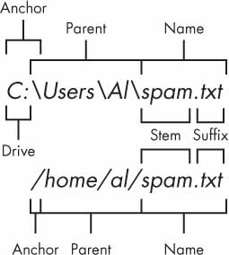
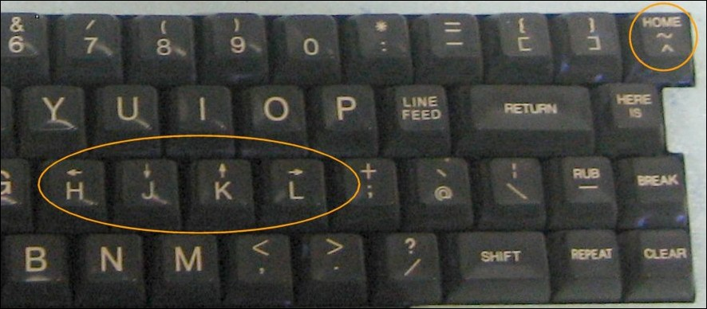

```{r setup}
#| message: False
#| warning: False
#| include: False
options(
  width=80
)

knitr::opts_chunk$set(
  fig.align = "center", fig.retina = 2, dpi = 150,
  out.width = "100%"
)

library(rvest)
```


## Filesystems

Pretty much all commonly used operating systems make use of a hierarchically structured filesystem.

This paradigm consists of directories which can contain files and other directories (which can then contain other files and directories and so on). 

{fig-align="center" width="25%"}


::: {.aside}
From [Chp 9](https://automatetheboringstuff.com/2e/chapter9/) of Automate the Boring Stuff with Python
:::


## Absolute vs relative paths

Paths can either be absolute or relative, and the difference is very important. For portability reasons you should almost never use absolute paths.

<br/>

#### Absolute path examples

```shell
/var/ftp/pub
/etc/samba.smb.conf
/boot/grub/grub.conf
```

<br/>

#### Relative path examples

```shell
Sta523/filesystem/
data/access.log
filesystem/nelle/pizza.cfg
```


## Special directories

```{r}
dir(path = "data/")
```

. . .

```{r}
dir(path = "data/", all.files = TRUE)
```

::: {.aside}
Files and directories starting with `.` are hidden by default, in the terminal use `ls -a`
:::

##

```{r}
dir(path = "../")
dir(path = "data/../../")
dir(path = "../../")
```


## Home directory and `~`

Tilde (`~`) is a shortcut that expands to the name of your home directory on unix-like systems.

```{r}
dir(path = "~/Desktop/Sta523-Sp25/website/")
```

## Why `~`?

Below is the keyboard from an [ADM-3A](https://en.wikipedia.org/wiki/ADM-3A) terminal from the 1970s,

{fig-align="center"}

::: {.aside}
See ["Stop Writing Dead Programs" by Jack Rusher (Strange Loop 2022)](https://www.youtube.com/watch?v=8Ab3ArE8W3s)
:::


## Working directories

R (and OSes) have the concept of a working directory, this is the directory where a program / script is being executed and determines the absolute path of any relative paths used.

```{r}
getwd()
```

. . .

```{r}
setwd("~/")
getwd()
```

##

{fig-align="center" width="66%"}

<br/>

::: {.aside}
Source: Jenny Bryan's [Zen and the Art of Workflow Maintenance](https://speakerdeck.com/jennybc/zen-and-the-art-of-workflow-maintenance)
:::


## RStudio and Working Directories

Just like R, RStudio also makes use of a working directory for each of your sessions -  we haven't had to discuss these yet because when you use an RStudio project, the working directory is automatically set to the directory containing the `Rproj` file.

. . .

This makes your project portable as all you need to do is to send the project folder to a collaborator (or push to GitHub) and they can open the project file and have identical *relative* path structure.


## Some useful base R filesystem functions

- `dir()` - list the contents of a directory

- `basename()` - Removes all of the path up to and include the last path separator (`/`)

- `dirname()` - Returns the path up to but excluding the last path separator 

- `file.path()` - a useful alternative to `paste0()` when combining paths (and urls) as it will add a `/` when necessary.

- `unlink()` - delete files and or directories

- `dir.create()` - create directories

- `fs` package - collection of filesystem related tools based on unix cli tools (e.g. `ls`)


# {.center-image}

{fig-align="center"}


## The fs package

The fs package provides a cross-platform, uniform interface to file system operations. It wraps system calls with consistent naming and behavior across operating systems.

```{r}
library(fs)
```

Key features:

- All functions are vectorized
- Provides consistent & helpful error messages on failure
- Handles paths consistently across Windows, Mac, and Linux
- Consistent naming scheme via function prefixes (`file_`, `dir_`, `path_`)


## Path manipulation - `path()`

The `path()` function constructs file paths "correctly" for the current OS:

::: {.small}
```{r}
path("data", "myfile.csv")
```
:::

. . .

::: {.small}
```{r}
path("~", "Desktop/", "/Sta523-Fa25")
```
:::

. . .

::: {.medium}
Other useful path functions:

- `path_abs()` - convert to absolute path
- `path_expand()` - expand `~` in paths
- `path_file()` - extract filename (like `basename()`)
- `path_dir()` - extract directory (like `dirname()`)
- `path_ext()` - extract file extension
- `path_ext_set()` - change file extension
:::

## Listing files and directories

`dir_ls()` lists directory contents with more information than `dir()`:

::: {.xsmall}
```{r}
dir_ls("data/")
```
:::

. . .

file lists can also be filtered via glob, regex, or type:,

::: {.xsmall}
```{r}
dir_ls("data/", glob = "*.csv")
```
:::

. . .

::: {.xsmall}
```{r}
dir_ls("data/", type = "file", recurse = TRUE)
```
:::


## Creating and deleting

Creating directories:

```{r}
#| eval: false
dir_create("data/temp")
dir_create("data/temp/a/b/c")
```

. . .

Deleting files and directories:

```{r}
#| eval: false
file_delete("data/myfile.csv")
dir_delete("data/temp")
```

## Copying and moving

Copy files or directories:

```{r}
#| eval: false
file_copy("data/file.csv", "backup/file.csv")
dir_copy("data/", "backup/")
```

. . .

Move (rename) files or directories:

```{r}
#| eval: false
file_move("data/old.csv", "data/new.csv")
```

. . .

Check if files/directories exist:

```{r}
#| eval: false
file_exists("data/myfile.csv")
dir_exists("data/temp")
```


## File metadata {.scrollable}

Get information about files:

::: {.xsmall}
```{r}
file_info("data/office_ratings.csv")
```
:::

. . . 

We can use vectorization to get info on multiple files,

::: {.xsmall}
```{r}
dir_ls("data/") |>
  file_info()
```
:::


# Denny's and LQ Scraping <br/> Demo
