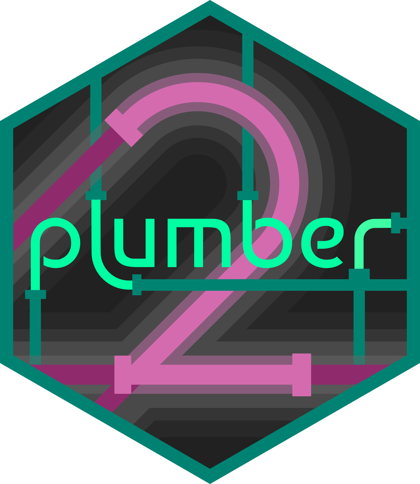

```{r setup}
#| message: False
#| warning: False
#| include: False
options(
  width=80
)

knitr::opts_chunk$set(
  fig.align = "center", fig.retina = 2, dpi = 150,
  out.width = "100%",
  message = TRUE
)

library(tidyverse )
library(rvest)
```


# 

{fig-align="center" width="50%"}

## plumber2

plumber and plumber2 are R packages that allow you to create RESTful APIs using specially annotated R scripts. 

Both packages make use of a Roxygen-like syntax to provide annotations (decorators) to R functions that then become the API endpoints with specific parameter, behaviors, etc.

plumber2 is a complete rewrite of plumber and it provides a more modern and flexible interface, improved performance, and additional features. The APIs between the two packages are not compatible. 

Like shiny - the package handles all the necessary processing as well as the launching of the necessary web server to host the API.

## A basic endpoint

A plumber2 API is just an R script that defines one or more of R functions that have specifically formatted comments that define the endpoint behavior.

Annotations are specified using `#*` comments directly above the function definition. Annotation keywords usign the `@` symbol.

For example the script below defines a single endpoint that responds to `GET` requests at the `/hello` path and returns the string "hello world". Note the 

```r
#* Return "hello world"
#* @get /hello
function() {
  "hello world"
}
```

::: {.aside}
`#*` is used here to avoid conflicts with roxygen comments - plumber supported both which occasionally caused issues.
:::

## Running your API

To run a plumber API you read the script in using the `api()` function to create a server object.

The API can then be launched using `api_run()` and stopped using `api_stop()`. When used interactively (i.e. in RStudio) the API will run in the background and not block your session.
 
Both the host/ip and port can be configured via `api()` or `api_run()`.

. . .

One important note is that plumber2 is relatively new and does not have full integration into RStudio yet and in most cases the IDE will get confused and assume your script is a plumber API - make sure to check what is actually running!


::: {.aside}
Your api server object can also be defined programmatically without a script file using the various `api_*()` functions.
:::


## Handler methods

When defining an endpoint you must specify the HTTP method(s) that the endpoint will respond to. As we just saw this is done using `@`+method keywords in your annotations. 

Each of your plumber2 endpoints can support one or more of the following verbs:

::: {.columns}
::: {.column width='33%'}
* `@get`
* `@post`
:::
::: {.column width='33%'}
* `@put`
* `@delete`
:::
::: {.column width='33%'}
* `@head`
* `@any`
:::
:::


. . .

:::: {.columns .mxsmall}
::: {.column width='50%'}
```r
#* @get /cars
function(){
  ...
}

#* @post /cars
function(){
  ...
}

#* @put /cars
function(){
  ...
}
```
:::

::: {.column width='50%'}
```r
#* @get /cars
#* @post /cars
#* @put /cars
function(){
  ...
}
```
:::
::::

## Endpoint inputs

When making requests to an API endpoint, data can be passed in a number of different ways:

* Via the path - e.g. `@get /user/<id>`

* via a query string - e.g. `@get /user?id=1231`

* or via the body of the request - e.g. `POST` or `PUT` requests

## Path parameters

Path parameters are indicated in the method annotations using `<>` around the parameter name.

Each parameter specified in the path must have a corresponding argument in the function definition.

While not required, it is good practice to include `@param` annotations for each parameter to document their purpose.

. . .

::: {.xsmall}
```r
#* Echo the parameter that was sent in
#*
#* @get /echo/<msg>
#*
#* @param msg:string The message to echo back.
#*
function(msg) {
  list(
    msg = paste0("The message is: '", msg, "'")
  )
}
```
:::

## Path priority

While this does not typically come up, it is helpful to understand how plumber2 handles potentially ambiguous paths.

When multiple endpoints could match a given request path, plumber2 uses the following priority rules to determine which endpoint to invoke:

::: {.small .center}
1. `/path/to/something/specific`

1. `/path/to/<name>/specific`

1. `/path/to/<name>/<setting>`

1. `/path/to/something/*`

1. `/path/*`
:::


## Query parameters

For endpoints users may pass in additional arguments using query strings, e.g. `?q=bread&pretty=1` at the end of the URL.

plumber2 will automatically parse these into a named list which can be accessed via the reserved `query` argument in the endpoint function.

Similar to path parameters additional documentation on query parameters can be provided via `@query` annotations.

. . .

::: {.xsmall}
```r
#* Fake search query endpoint ala DuckDuckGo
#* 
#* @get /
#* 
#* @query q:string The search query
#* @query pretty:int Whether to pretty-print the results (1) or not (0)
#* 
function(query) {
  paste0("The q parameter is '", query$q %||% "", "'. ",
         "The pretty parameter is '", query$pretty %||% 0, "'.")
}
```
:::


## Type hints

Path and query parameters are transmitted as strings by default, if you are expecting a different type you can specify it using a type hint in the `@param` or `@query` annotation.

The following types are supported by default:

::: {.small}
|  R Type     | Plumber Name |
|-------------+--------------|
| `logical`   |	boolean      |
| `numeric`   |	number       |
| `integer`   |	integer      |
| `character` |	string       |
| `Date`	    |  date        |
| `POSIXlt`   | date-time    |
| `raw`	      | byte, binary |
| vector      | `[...]`      |
| `list`      | object (`{name:Type, ...}`) |
:::

## Request body

Both path and query parameters are passed in via the URL - this works for relatively small amounts of data but is not a good option for larger payloads.

Larger data can be passed in the body of the request - this is typically used with  `PUT`, `POST`, and `PATCH` requests. The size limit varies a lot depending on the API server configuration but is typically around ~2MB by default.

. . .

By default plumber2 will attempt to parse the body based on the `Content-Type` header of the request. Further control can be achieved using the `@parser` annotation - there are a large number of built-in parsers available and custom parsers can also be defined.

. . .

The result of parsing the body is made available to the endpoint function via the reserved `body` argument.


## Serialization

By default, the return value of a plumber2 endpoint is serialized to JSON (via `jsonlite`). This can be overridden by using the `@serializer` annotation.

Some of the available serializers,

::: xsmall
Annotation | Content Type | Description/References
---------- | ------------ | ---------------------
`@serializer html` | `text/html; charset=UTF-8` | Passes response through without 
`@serializer json` | `application/json` | Object processed with `jsonlite::toJSON()`
`@serializer csv` | `text/csv` | Object processed with `readr::format_csv()`
`@serializer text` | `text/plain` | Text output processed by `as.character()`
`@serializer jpeg` | `image/jpeg` | Images created with `jpeg()`
`@serializer png` | `image/png` | Images created with `png()`
`@serializer svg` | `image/svg` | Images created with `svg()`
`@serializer pdf` | `application/pdf` | PDF File created with `pdf()`
`@serializer rds` |	`application/rds`	| Object processed with base::serialize()
`@serializer parquet` |	`application/parquet` |	Object processed with nanoparquet::write_parquet()
:::


::: aside
For a full list see the [Rendering output](https://plumber2.posit.co/articles/rendering-output.html#serializers) article.
:::

## Plot output

::: {.small}
```r
#* Plot out data from the palmer penguins dataset
#*
#* @get /plot
#*
#* @query spec:string If provided, filter the data to only this species
#* (e.g. 'Adelie')
#*
#* @serializer png
#*
function(query) {
  myData <- penguins
  title <- "All Species"
  
  # Filter if the species was specified
  if (!is.null(query$spec)){
    title <- paste0("Only the '", query$spec, "' Species")
    myData <- subset(myData, species == query$spec)
  }
  
  plot(
    myData$flipper_len,
    myData$bill_len,
    main=title,
    xlab="Flipper Length (mm)",
    ylab="Bill Length (mm)"
  )
}
```
:::


## `request`

One additional reserved argument available to plumber2 endpoint functions is `request`. This is a [`reqres`](https://reqres.data-imaginist.com/reference/Request.html) object that provides access to the full HTTP request details as an R6 object.

From this it is possible to get access to: cookies, headers, raw query string, raw body content, and much more.

## `response` & `server`

Similar to `request`, the `response` reserved argument provides access to a [`reqres`](https://reqres.data-imaginist.com/reference/Response.html) response object that represents the HTTP response.

Normally, plumber2 will construct this object for you, but if necessary you can modify it directly to set custom headers, cookies, status codes, and body content.

. . .

Finally, the `server` reserved argument provides access to the underlying plumber2 API server object itself. This is useful for advanced use cases.


## Errors

Plumber2 wraps all endpoints to handle errors that occur during execution.

::: {.small}
```r
#* Example of throwing an error
#* @get /simple
function() {
  stop("I'm an error!")
}
```
:::

. . .

By default these errors will return a generic 500 Internal Server Error response to the user. However, plumber2 (and reqres) provides a number of helper functions to generate more friendly error messages with appropriate HTTP status codes.

::: {.small}
```r
#* Generate a friendly error
#* @get /friendly
function() {
  abort_bad_request(
    "Your request could not be parsed"
  )
}
```
:::


## Live Demo